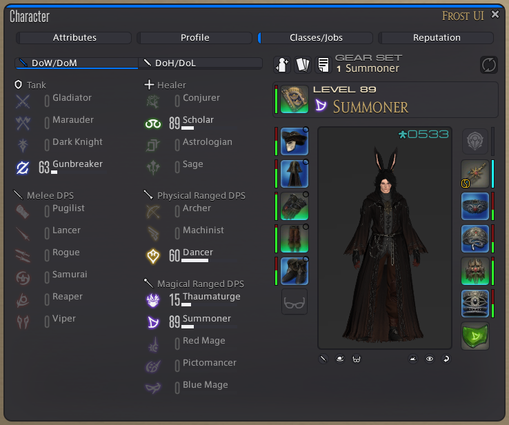
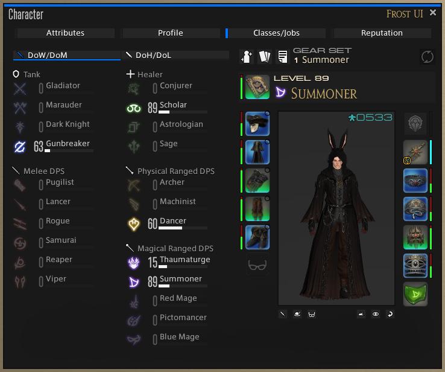
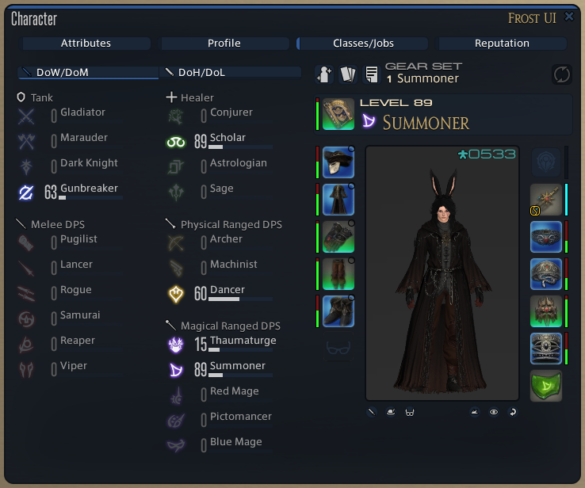
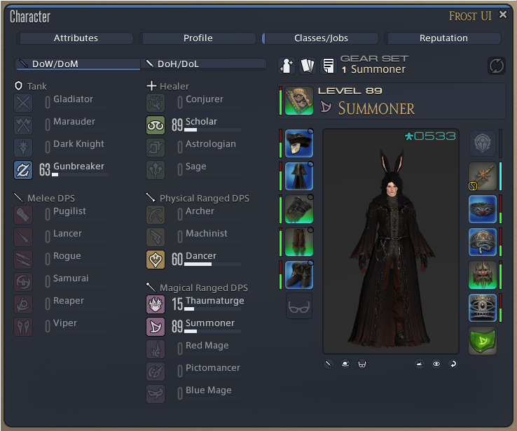
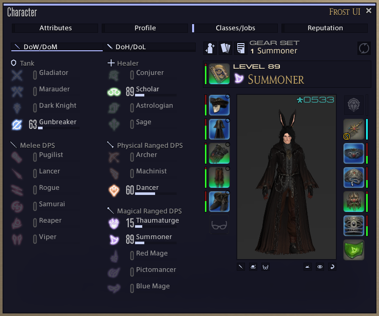
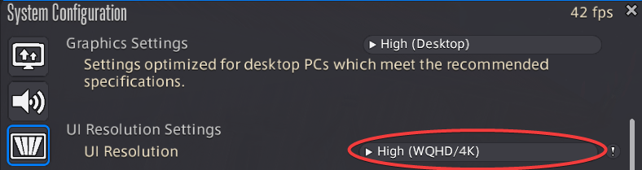
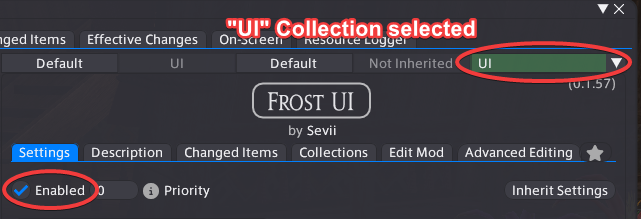

# Frost UI
A UI mod for Final Fantasy XIV

# Previews
### Presets showing off some customization ability
Frost UI (Default)

Material UI (Default)

Nightfox (by Bun Bo)

Nord Dark (by djUSA.GI)

Catppuccin Mocha Lavender Material UI (by fmauNeko)

### Other elements
-- todo

# Install Guide

## Prerequisites
Before installing Frost UI you will need the following things installed (the links below take you to their pages):

[dalamud](https://dalamud.dev/faq/getting-started) | [penumbra](https://github.com/xivdev/Penumbra?tab=readme-ov-file#installing)

you also will want to set your in game resolution settings to 4K:

## Instructions
1. Upon installing Penumbra you will want to create a collection for your UI mods. The Penumbra tutorial should explain how to do this.

2. Install Aetherment by opening your Dalamud settings, clicking the "Experimental" tab and add the following to your custom repository list: `https://aetherment.sevii.dev/plugin`

3. Click the plus sign next to the input field, and then save your settings.

4. Open Aetherment by typing `/aetherment` into your chat window.

5. Click on the "Mods" tab in Aetherment and install the latest version of Frost UI. (Don't close this window, we'll come back here later!)

6. Open Penumbra (by typing `/penumbra` in your chat window) and click the "Mods" tab.

7. Ensure your "UI" collection is selected, and enable the Frost UI.

8. Go *back* to the Aetherment window and open the Mods tab. Make sure your UI collection is selected in the top right dropdown.

9. Click on the Frost UI and edit the options as you wish. There are also preset available.

10. Once satisfied with your options, click the "Apply" button.

11. Restart your game and you should be good to go!

# License
The following sub-directories are licensed under [CC-BY-4.0](LICENSE-CC-BY-4.0)
- assets
- raw
- vectors

Anything else is licensed under [Apache-2.0](LICENSE-Apache-2.0)

# Support
If you wish to support me and my work, you can do so [here](https://buymeacoffee.com/sevii77)